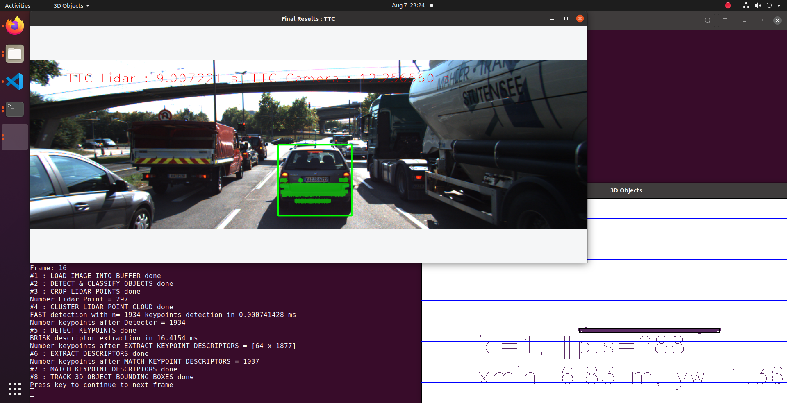
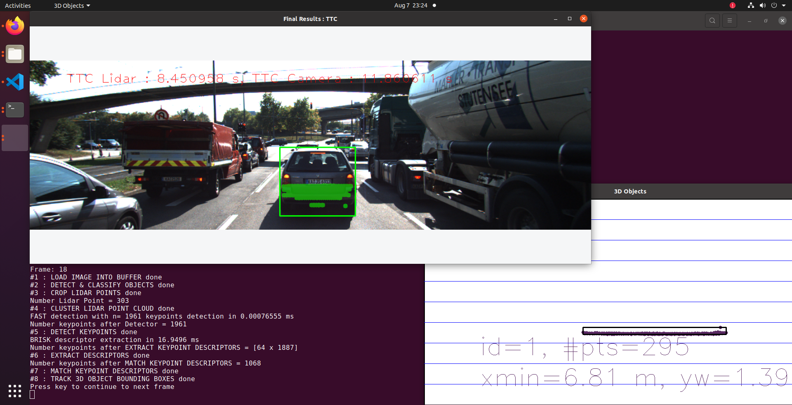

# SFND 3D Object Tracking

Welcome to the final project of the camera course. By completing all the lessons, you now have a solid understanding of keypoint detectors, descriptors, and methods to match them between successive images. Also, you know how to detect objects in an image using the YOLO deep-learning framework. And finally, you know how to associate regions in a camera image with Lidar points in 3D space. Let's take a look at our program schematic to see what we already have accomplished and what's still missing.


In this final project, you will implement the missing parts in the schematic. To do this, you will complete four major tasks: 
1. First, you will develop a way to match 3D objects over time by using keypoint correspondences. 
2. Second, you will compute the TTC based on Lidar measurements. 
3. You will then proceed to do the same using the camera, which requires to first associate keypoint matches to regions of interest and then to compute the TTC based on those matches. 
4. And lastly, you will conduct various tests with the framework. Your goal is to identify the most suitable detector/descriptor combination for TTC estimation and also to search for problems that can lead to faulty measurements by the camera or Lidar sensor. In the last course of this Nanodegree, you will learn about the Kalman filter, which is a great way to combine the two independent TTC measurements into an improved version which is much more reliable than a single sensor alone can be. But before we think about such things, let us focus on your final project in the camera course. 

## Dependencies for Running Locally
* cmake >= 2.8
  * All OSes: [click here for installation instructions](https://cmake.org/install/)
* make >= 4.1 (Linux, Mac), 3.81 (Windows)
  * Linux: make is installed by default on most Linux distros
  * Mac: [install Xcode command line tools to get make](https://developer.apple.com/xcode/features/)
  * Windows: [Click here for installation instructions](http://gnuwin32.sourceforge.net/packages/make.htm)
* Git LFS
  * Weight files are handled using [LFS](https://git-lfs.github.com/)
  * Install Git LFS before cloning this Repo.
* OpenCV >= 4.1
  * This must be compiled from source using the `-D OPENCV_ENABLE_NONFREE=ON` cmake flag for testing the SIFT and SURF detectors.
  * The OpenCV 4.1.0 source code can be found [here](https://github.com/opencv/opencv/tree/4.1.0)
* gcc/g++ >= 5.4
  * Linux: gcc / g++ is installed by default on most Linux distros
  * Mac: same deal as make - [install Xcode command line tools](https://developer.apple.com/xcode/features/)
  * Windows: recommend using [MinGW](http://www.mingw.org/)

## Basic Build Instructions

1. Clone this repo.
2. Make a build directory in the top level project directory: `mkdir build && cd build`
3. Compile: `cmake .. && make`
4. Run it: `./3D_object_tracking`.


## Rubric

#### **FP1: Match 3D Objects**

Implemented the method ```matchBoundingBoxes()``` which takes the current/previous data frames as inputs and outputs the ids of the matched regions of interest. Matches must be the ones with the highest number of keypoint correspondences.

#### **FP2: Compute Lidar TTC**

Implemented the method ```computeTTCLidar()``` which computes the TTC for matched 3D objects using only lidat measurments from the matched bounding boxes between the current/previous frames.

In order to reduce the risk of outliers only the lidar points within the ego lane were considered and the mean distance was taken in order to produce a stable output.

Using the standard deviation away (3*sigma rule) to remove outliers.

```c++
double calculateMedianDistanceUsingStandardDeviationAway(std::vector<double> &data)
{
    // Calulate Mean
    double sum = 0.0;
    for (auto &value : data)
    {
        sum += value;
    }
    double mean = sum / data.size();
    // Calculate Standard Deviation
    double sumVariance = 0.0;
    for (auto &value : data)
    {
        sumVariance += pow(value - mean, 2);
    }
    double standardDeviation = sqrt(sumVariance / data.size());

    // remove outlines data
    double threshold = 3.0 * standardDeviation;
    std::vector<double> dataAfterRemove;
    for (auto &value : data)
    {
        if (abs(value - mean) < threshold)
        {
            dataAfterRemove.push_back(value);
        }
    }
    return std::accumulate(dataAfterRemove.begin(), dataAfterRemove.end(), 0.0) / dataAfterRemove.size();
}
```

#### **FP3: Associate Keypoints with Bounding Boxes**

Implemented the method: ```clusterKptMatchesWithROI()``` which associates keypoints with the bounding box that encloses them. All matches between current/previous frame are pushed to a vector within the respective bounding box.

#### **FP4: Compute Camera TTC**

Implemented the method: ```computeTTCCamera()``` which examines the distance ratios between keypoint matches in the current/previous frames - this ratio is then used to compute the TTC.

#### **FP5: Performance Evaluation**
Frame | Image| TTC Lidar 
:---: | :---: |:---:
16    || 9.007221 |
17    || 10.862383 |
18    || 8.450958 |


After observing, it seems that at frame 16, the vehicle in front has stopped completely because of the red light, according to the reality, TTS must be reduced because the lidar is approaching. However, after calculating, TTS increases in frame 17.
=> The current model's inability to deal with deceleration.

#### **FP6: Performance Evaluation**

**Detector = SHITOMASI, Descriptor = BRISK**
Frame | Number Lidar points | TTC Lidar | TTC Camera | TCC Diff
:---: | :---: | :---:  | :---: | :---:
1 | 340 | 12.187797 | 39.148297 | 26.960500
2 | 309 | 13.115676 | -inf | inf
3 | 326 | 16.788090 | 13.490395 | 3.297695
4 | 322 | 14.598984 | 12.397977 | 2.201006
5 | 344 | 12.797997 | 12.675404 | 0.122592
6 | 352 | 13.294750 | -inf | inf
7 | 317 | 13.745902 | -inf | inf
8 | 312 | 13.741533 | -inf | inf
9 | 311 | 11.754923 | 11.512622 | 0.242302
10 | 286 | 12.139050 | -inf | inf
11 | 302 | 11.913053 | 11.302411 | 0.610641
12 | 302 | 10.281722 | 11.652406 | 1.370684
13 | 316 | 9.177242 | 11.724344 | 2.547102
14 | 312 | 9.483886 | 11.878117 | 2.394230
15 | 289 | 8.428278 | 9.337846 | 0.909568
16 | 297 | 9.007221 | 11.307930 | 2.300709
17 | 279 | 10.862383 | 11.448724 | 0.586341
18 | 303 | 8.450958 | 9.127923 | 0.676965

**Detector = SHITOMASI, Descriptor = BRIEF**
Frame | Number Lidar points | TTC Lidar | TTC Camera | TCC Diff
:---: | :---: | :---:  | :---: | :---:
1 | 340 | 12.187797 | 13.894765 | 1.706967
2 | 309 | 13.115676 | 13.148670 | 0.032994
3 | 326 | 16.788090 | 14.917303 | 1.870787
4 | 322 | 14.598984 | 13.079095 | 1.519888
5 | 344 | 12.797997 | 12.188597 | 0.609400
6 | 352 | 13.294750 | 15.156050 | 1.861300
7 | 317 | 13.745902 | 18.336755 | 4.590853
8 | 312 | 13.741533 | 12.379314 | 1.362219
9 | 311 | 11.754923 | 12.462969 | 0.708045
10 | 286 | 12.139050 | 13.344794 | 1.205744
11 | 302 | 11.913053 | 12.258695 | 0.345643
12 | 302 | 10.281722 | 12.769816 | 2.488094
13 | 316 | 9.177242 | 12.324332 | 3.147090
14 | 312 | 9.483886 | 14.684487 | 5.200601
15 | 289 | 8.428278 | 22.118436 | 13.690158
16 | 297 | 9.007221 | 11.385566 | 2.378345
17 | 279 | 10.862383 | 13.606274 | 2.743892
18 | 303 | 8.450958 | 7.750389 | 0.700570

**Detector = SHITOMASI, Descriptor = ORB**

Frame | Number Lidar points | TTC Lidar | TTC Camera | TCC Diff
:---: | :---: | :---:  | :---: | :---:
1 | 340 | 12.187797 | 13.880059 | 1.692262
2 | 309 | 13.115676 | 17.733267 | 4.617592
3 | 326 | 16.788090 | 11.662613 | 5.125476
4 | 322 | 14.598984 | 12.150608 | 2.448376
5 | 344 | 12.797997 | 12.330465 | 0.467532
6 | 352 | 13.294750 | 15.153642 | 1.858891
7 | 317 | 13.745902 | 15.006519 | 1.260617
8 | 312 | 13.741533 | 12.184751 | 1.556782
9 | 311 | 11.754923 | 11.273955 | 0.480968
10 | 286 | 12.139050 | 13.134534 | 0.995484
11 | 302 | 11.913053 | 11.302678 | 0.610374
12 | 302 | 10.281722 | 12.769816 | 2.488094
13 | 316 | 9.177242 | 12.111922 | 2.934680
14 | 312 | 9.483886 | 14.684487 | 5.200601
15 | 289 | 8.428278 | 10.264245 | 1.835967
16 | 297 | 9.007221 | 13.435673 | 4.428452
17 | 279 | 10.862383 | 13.526059 | 2.663676
18 | 303 | 8.450958 | 12.090571 | 3.639612

**Detector = SHITOMASI, Descriptor = FREAK**

Frame | Number Lidar points | TTC Lidar | TTC Camera | TCC Diff
:---: | :---: | :---:  | :---: | :---:
1 | 340 | 12.187797 | 13.724887 | 1.537090
2 | 309 | 13.115676 | 13.092722 | 0.022954
3 | 326 | 16.788090 | 11.470275 | 5.317815
4 | 322 | 14.598984 | 12.535398 | 2.063586
5 | 344 | 12.797997 | 12.370474 | 0.427523
6 | 352 | 13.294750 | 14.238518 | 0.943767
7 | 317 | 13.745902 | 12.564543 | 1.181359
8 | 312 | 13.741533 | 12.851473 | 0.890060
9 | 311 | 11.754923 | 12.041425 | 0.286502
10 | 286 | 12.139050 | 13.008396 | 0.869346
11 | 302 | 11.913053 | 11.961899 | 0.048847
12 | 302 | 10.281722 | 11.822715 | 1.540993
13 | 316 | 9.177242 | 12.343584 | 3.166342
14 | 312 | 9.483886 | -inf | inf
15 | 289 | 8.428278 | 10.296963 | 1.868685
16 | 297 | 9.007221 | 11.315296 | 2.308075
17 | 279 | 10.862383 | 12.963025 | 2.100642
18 | 303 | 8.450958 | 11.281053 | 2.830095


**Detector = SHITOMASI, Descriptor = AKAZE**

ERROR

**Detector = SHITOMASI, Descriptor = SIFT**

ERROR

**Detector = HARRIS, Descriptor = BRISK**
Frame | Number Lidar points | TTC Lidar | TTC Camera | TCC Diff
:---: | :---: | :---:  | :---: | :---:
1 | 340 | 12.187797 | -inf | inf
2 | 309 | 13.115676 | 10.585996 | 2.529679
3 | 326 | 16.788090 | 26.290469 | 9.502379
4 | 322 | 14.598984 | 10.978246 | 3.620738
5 | 344 | 12.797997 | -inf | inf
6 | 352 | 13.294750 | nan | nan
7 | 317 | 13.745902 | 11.694714 | 2.051188
8 | 312 | 13.741533 | 17.620382 | 3.878848
9 | 311 | 11.754923 | nan | nan
10 | 286 | 12.139050 | -inf | inf
11 | 302 | 11.913053 | -inf | inf
12 | 302 | 10.281722 | -inf | inf
13 | 316 | 9.177242 | -inf | inf
14 | 312 | 9.483886 | nan | nan
15 | 289 | 8.428278 | -13.626283 | 22.054561
16 | 297 | 9.007221 | 6.657258 | 2.349963
17 | 279 | 10.862383 | nan | nan
18 | 303 | 8.450958 | -inf | inf

**Detector = HARRIS, Descriptor = BRIEF**
Frame | Number Lidar points | TTC Lidar | TTC Camera | TCC Diff
:---: | :---: | :---:  | :---: | :---:
1 | 340 | 12.187797 | 10.908219 | 1.279578
2 | 309 | 13.115676 | nan | nan
3 | 326 | 16.788090 | -inf | inf
4 | 322 | 14.598984 | 10.978246 | 3.620738
5 | 344 | 12.797997 | 35.383263 | 22.585266
6 | 352 | 13.294750 | 13.590710 | 0.295960
7 | 317 | 13.745902 | 13.496977 | 0.248925
8 | 312 | 13.741533 | -inf | inf
9 | 311 | 11.754923 | nan | nan
10 | 286 | 12.139050 | 20.586216 | 8.447166
11 | 302 | 11.913053 | -inf | inf
12 | 302 | 10.281722 | 12.244994 | 1.963272
13 | 316 | 9.177242 | 13.432725 | 4.255483
14 | 312 | 9.483886 | 5.606097 | 3.877790
15 | 289 | 8.428278 | -inf | inf
16 | 297 | 9.007221 | 7.037751 | 1.969470
17 | 279 | 10.862383 | 12.584845 | 1.722462
18 | 303 | 8.450958 | -inf | inf


**Detector = HARRIS, Descriptor = ORB**
Frame | Number Lidar points | TTC Lidar | TTC Camera | TCC Diff
:---: | :---: | :---:  | :---: | :---:
1 | 340 | 12.187797 | 10.908219 | 1.279578
2 | 309 | 13.115676 | nan | nan
3 | 326 | 16.788090 | -inf | inf
4 | 322 | 14.598984 | 10.978246 | 3.620738
5 | 344 | 12.797997 | 35.383263 | 22.585266
6 | 352 | 13.294750 | nan | nan
7 | 317 | 13.745902 | 13.190481 | 0.555421
8 | 312 | 13.741533 | -inf | inf
9 | 311 | 11.754923 | nan | nan
10 | 286 | 12.139050 | -inf | inf
11 | 302 | 11.913053 | 11.741430 | 0.171623
12 | 302 | 10.281722 | -inf | inf
13 | 316 | 9.177242 | -inf | inf
14 | 312 | 9.483886 | 5.660966 | 3.822921
15 | 289 | 8.428278 | -inf | inf
16 | 297 | 9.007221 | 10.932493 | 1.925272
17 | 279 | 10.862383 | 12.584845 | 1.722462
18 | 303 | 8.450958 | -inf | inf

**Detector = HARRIS, Descriptor = FREAK**
Frame | Number Lidar points | TTC Lidar | TTC Camera | TCC Diff
:---: | :---: | :---:  | :---: | :---:
1 | 340 | 12.187797 | 21.816439 | 9.628641
2 | 309 | 13.115676 | nan | nan
3 | 326 | 16.788090 | nan | nan
4 | 322 | 14.598984 | 12.128391 | 2.470592
5 | 344 | 12.797997 | 39.584029 | 26.786032
6 | 352 | 13.294750 | nan | nan
7 | 317 | 13.745902 | 12.337898 | 1.408004
8 | 312 | 13.741533 | 12.916210 | 0.825323
9 | 311 | 11.754923 | nan | nan
10 | 286 | 12.139050 | -inf | inf
11 | 302 | 11.913053 | -inf | inf
12 | 302 | 10.281722 | -inf | inf
13 | 316 | 9.177242 | 13.432725 | 4.255483
14 | 312 | 9.483886 | nan | nan
15 | 289 | 8.428278 | -inf | inf
16 | 297 | 9.007221 | 6.717055 | 2.290166
17 | 279 | 10.862383 | nan | nan
18 | 303 | 8.450958 | nan | nan


**Detector = HARRIS, Descriptor = AKAZE**

ERROR

**Detector = HARRIS, Descriptor = SIFT**

ERROR

**Detector = FAST, Descriptor = BRISK**
Frame | Number Lidar points | TTC Lidar | TTC Camera | TCC Diff
:---: | :---: | :---:  | :---: | :---:
1 | 340 | 12.187797 | 12.300000 | 0.112203
2 | 309 | 13.115676 | 12.345282 | 0.770394
3 | 326 | 16.788090 | 16.616273 | 0.171816
4 | 322 | 14.598984 | 12.885663 | 1.713320
5 | 344 | 12.797997 | -inf | inf
6 | 352 | 13.294750 | 13.038573 | 0.256177
7 | 317 | 13.745902 | 12.040983 | 1.704919
8 | 312 | 13.741533 | 11.406610 | 2.334923
9 | 311 | 11.754923 | 11.868356 | 0.113432
10 | 286 | 12.139050 | 13.347326 | 1.208276
11 | 302 | 11.913053 | 12.949216 | 1.036163
12 | 302 | 10.281722 | 12.117402 | 1.835680
13 | 316 | 9.177242 | 12.778433 | 3.601191
14 | 312 | 9.483886 | 11.607725 | 2.123839
15 | 289 | 8.428278 | 11.407860 | 2.979583
16 | 297 | 9.007221 | 12.256560 | 3.249339
17 | 279 | 10.862383 | 9.293304 | 1.569079
18 | 303 | 8.450958 | 11.860611 | 3.409653

**Detector = FAST, Descriptor = BRIEF**
Frame | Number Lidar points | TTC Lidar | TTC Camera | TCC Diff
:---: | :---: | :---:  | :---: | :---:
1 | 340 | 12.187797 | 11.177575 | 1.010222
2 | 309 | 13.115676 | 13.006897 | 0.108779
3 | 326 | 16.788090 | 14.820583 | 1.967507
4 | 322 | 14.598984 | 13.248256 | 1.350728
5 | 344 | 12.797997 | -inf | inf
6 | 352 | 13.294750 | 41.782307 | 28.487557
7 | 317 | 13.745902 | 12.758325 | 0.987577
8 | 312 | 13.741533 | 12.766404 | 0.975129
9 | 311 | 11.754923 | 13.923081 | 2.168158
10 | 286 | 12.139050 | 16.214137 | 4.075088
11 | 302 | 11.913053 | 13.635546 | 1.722493
12 | 302 | 10.281722 | 12.983142 | 2.701420
13 | 316 | 9.177242 | 13.148670 | 3.971428
14 | 312 | 9.483886 | 11.703404 | 2.219518
15 | 289 | 8.428278 | 12.607115 | 4.178837
16 | 297 | 9.007221 | 14.551571 | 5.544350
17 | 279 | 10.862383 | 11.341063 | 0.478680
18 | 303 | 8.450958 | 13.790759 | 5.339801

**Detector = FAST, Descriptor = ORB**
Frame | Number Lidar points | TTC Lidar | TTC Camera | TCC Diff
:---: | :---: | :---:  | :---: | :---:
1 | 340 | 12.187797 | 11.999320 | 0.188477
2 | 309 | 13.115676 | 12.979305 | 0.136371
3 | 326 | 16.788090 | 26.572394 | 9.784305
4 | 322 | 14.598984 | 14.244157 | 0.354827
5 | 344 | 12.797997 | -inf | inf
6 | 352 | 13.294750 | 55.978844 | 42.684094
7 | 317 | 13.745902 | 12.426376 | 1.319526
8 | 312 | 13.741533 | 12.186040 | 1.555493
9 | 311 | 11.754923 | 12.871126 | 1.116203
10 | 286 | 12.139050 | -inf | inf
11 | 302 | 11.913053 | -inf | inf
12 | 302 | 10.281722 | 13.163589 | 2.881867
13 | 316 | 9.177242 | 13.562908 | 4.385666
14 | 312 | 9.483886 | 11.111480 | 1.627594
15 | 289 | 8.428278 | 10.843857 | 2.415579
16 | 297 | 9.007221 | 11.393874 | 2.386653
17 | 279 | 10.862383 | 12.165587 | 1.303204
18 | 303 | 8.450958 | 109.968649 | 101.517691


**Detector = FAST, Descriptor = FREAK**

Frame | Number Lidar points | TTC Lidar | TTC Camera | TCC Diff
:---: | :---: | :---:  | :---: | :---:
1 | 340 | 12.187797 | 51.577224 | 39.389427
2 | 309 | 13.115676 | 16.138734 | 3.023059
3 | 326 | 16.788090 | 13.406883 | 3.381207
4 | 322 | 14.598984 | 14.031572 | 0.567412
5 | 344 | 12.797997 | 99.764261 | 86.966264
6 | 352 | 13.294750 | 12.329150 | 0.965600
7 | 317 | 13.745902 | 12.753004 | 0.992898
8 | 312 | 13.741533 | 11.546717 | 2.194816
9 | 311 | 11.754923 | -inf | inf
10 | 286 | 12.139050 | 13.416893 | 1.277843
11 | 302 | 11.913053 | 13.019157 | 1.106105
12 | 302 | 10.281722 | 12.036413 | 1.754691
13 | 316 | 9.177242 | 11.659949 | 2.482707
14 | 312 | 9.483886 | 11.348694 | 1.864808
15 | 289 | 8.428278 | 11.029640 | 2.601362
16 | 297 | 9.007221 | 12.101945 | 3.094724
17 | 279 | 10.862383 | 11.067669 | 0.205286
18 | 303 | 8.450958 | 11.860611 | 3.409653

**Detector = FAST, Descriptor = AKAZE**

ERROR

**Detector = FAST, Descriptor = SIFT**

ERROR

**Detector = BRISK, Descriptor = BRISK**

Frame | Number Lidar points | TTC Lidar | TTC Camera | TCC Diff
:---: | :---: | :---:  | :---: | :---:
1 | 340 | 12.187797 | 13.031013 | 0.843216
2 | 309 | 13.115676 | 23.102704 | 9.987028
3 | 326 | 16.788090 | 18.998933 | 2.210843
4 | 322 | 14.598984 | 15.203116 | 0.604132
5 | 344 | 12.797997 | 26.094936 | 13.296939
6 | 352 | 13.294750 | 16.426118 | 3.131367
7 | 317 | 13.745902 | 16.856280 | 3.110378
8 | 312 | 13.741533 | 23.428792 | 9.687259
9 | 311 | 11.754923 | 15.464508 | 3.709584
10 | 286 | 12.139050 | 13.412117 | 1.273067
11 | 302 | 11.913053 | 12.136334 | 0.223281
12 | 302 | 10.281722 | 11.010747 | 0.729025
13 | 316 | 9.177242 | 11.850547 | 2.673305
14 | 312 | 9.483886 | 12.037588 | 2.553701
15 | 289 | 8.428278 | 16.032303 | 7.604025
16 | 297 | 9.007221 | 11.296855 | 2.289635
17 | 279 | 10.862383 | 9.898668 | 0.963715
18 | 303 | 8.450958 | 13.034761 | 4.583802


**Detector = BRISK, Descriptor = BRIEF**
Frame | Number Lidar points | TTC Lidar | TTC Camera | TCC Diff
:---: | :---: | :---:  | :---: | :---:
1 | 340 | 12.187797 | 15.849072 | 3.661275
2 | 309 | 13.115676 | 26.023004 | 12.907328
3 | 326 | 16.788090 | 21.672818 | 4.884728
4 | 322 | 14.598984 | 23.618613 | 9.019630
5 | 344 | 12.797997 | 26.675177 | 13.877180
6 | 352 | 13.294750 | 49.054128 | 35.759377
7 | 317 | 13.745902 | 25.286738 | 11.540836
8 | 312 | 13.741533 | 18.406368 | 4.664834
9 | 311 | 11.754923 | 24.177677 | 12.422753
10 | 286 | 12.139050 | 19.133637 | 6.994587
11 | 302 | 11.913053 | 21.944723 | 10.031670
12 | 302 | 10.281722 | 17.875698 | 7.593976
13 | 316 | 9.177242 | 17.924288 | 8.747046
14 | 312 | 9.483886 | 17.230997 | 7.747111
15 | 289 | 8.428278 | 11.053967 | 2.625689
16 | 297 | 9.007221 | 17.194973 | 8.187752
17 | 279 | 10.862383 | 15.307591 | 4.445209
18 | 303 | 8.450958 | 18.143898 | 9.692940


**Detector = BRISK, Descriptor = ORB**

Frame | Number Lidar points | TTC Lidar | TTC Camera | TCC Diff
:---: | :---: | :---:  | :---: | :---:
1 | 340 | 12.187797 | 30.781875 | 18.594078
2 | 309 | 13.115676 | 20.155511 | 7.039835
3 | 326 | 16.788090 | 18.385081 | 1.596992
4 | 322 | 14.598984 | 17.497780 | 2.898797
5 | 344 | 12.797997 | 29.379124 | 16.581127
6 | 352 | 13.294750 | 20.628978 | 7.334227
7 | 317 | 13.745902 | 21.224423 | 7.478520
8 | 312 | 13.741533 | 16.069143 | 2.327610
9 | 311 | 11.754923 | 15.472820 | 3.717896
10 | 286 | 12.139050 | 12.688378 | 0.549328
11 | 302 | 11.913053 | 13.970295 | 2.057243
12 | 302 | 10.281722 | 15.555382 | 5.273659
13 | 316 | 9.177242 | 11.518932 | 2.341690
14 | 312 | 9.483886 | 12.225868 | 2.741981
15 | 289 | 8.428278 | 11.465120 | 3.036842
16 | 297 | 9.007221 | 18.132458 | 9.125237
17 | 279 | 10.862383 | 10.689332 | 0.173051
18 | 303 | 8.450958 | 12.333779 | 3.882820

**Detector = BRISK, Descriptor = FREAK**

Frame | Number Lidar points | TTC Lidar | TTC Camera | TCC Diff
:---: | :---: | :---:  | :---: | :---:
1 | 340 | 12.187797 | 12.360057 | 0.172260
2 | 309 | 13.115676 | 20.455489 | 7.339813
3 | 326 | 16.788090 | 13.580680 | 3.207409
4 | 322 | 14.598984 | 13.829347 | 0.769637
5 | 344 | 12.797997 | 22.592758 | 9.794761
6 | 352 | 13.294750 | 16.330385 | 3.035634
7 | 317 | 13.745902 | 15.446334 | 1.700432
8 | 312 | 13.741533 | 23.807828 | 10.066294
9 | 311 | 11.754923 | 19.580285 | 7.825361
10 | 286 | 12.139050 | 14.013799 | 1.874749
11 | 302 | 11.913053 | 16.986802 | 5.073749
12 | 302 | 10.281722 | 12.999512 | 2.717790
13 | 316 | 9.177242 | 16.402834 | 7.225592
14 | 312 | 9.483886 | 12.151651 | 2.667765
15 | 289 | 8.428278 | 19.522064 | 11.093786
16 | 297 | 9.007221 | 10.379768 | 1.372547
17 | 279 | 10.862383 | 9.245771 | 1.616611
18 | 303 | 8.450958 | 11.658371 | 3.207412


**Detector = BRISK, Descriptor = AKAZE**

ERROR

**Detector = BRISK, Descriptor = SIFT**

ERROR

**Detector = AKAZE, Descriptor = BRISK**
Frame | Number Lidar points | TTC Lidar | TTC Camera | TCC Diff
:---: | :---: | :---:  | :---: | :---:
1 | 340 | 12.187797 | 17.930112 | 5.742315
2 | 309 | 13.115676 | 22.649687 | 9.534012
3 | 326 | 16.788090 | 13.365882 | 3.422208
4 | 322 | 14.598984 | 17.970655 | 3.371672
5 | 344 | 12.797997 | 19.428317 | 6.630320
6 | 352 | 13.294750 | 14.708415 | 1.413665
7 | 317 | 13.745902 | 15.883252 | 2.137350
8 | 312 | 13.741533 | 13.922941 | 0.181407
9 | 311 | 11.754923 | 13.823354 | 2.068430
10 | 286 | 12.139050 | 16.450851 | 4.311802
11 | 302 | 11.913053 | 12.362651 | 0.449598
12 | 302 | 10.281722 | 15.617438 | 5.335716
13 | 316 | 9.177242 | 10.085526 | 0.908284
14 | 312 | 9.483886 | 15.221118 | 5.737232
15 | 289 | 8.428278 | 16.897213 | 8.468935
16 | 297 | 9.007221 | 14.341879 | 5.334658
17 | 279 | 10.862383 | 12.290986 | 1.428603
18 | 303 | 8.450958 | 8.925236 | 0.474278

**Detector = AKAZE, Descriptor = BRIEF**
Frame | Number Lidar points | TTC Lidar | TTC Camera | TCC Diff
:---: | :---: | :---:  | :---: | :---:
1 | 340 | 12.187797 | 18.886493 | 6.698695
2 | 309 | 13.115676 | 15.045547 | 1.929872
3 | 326 | 16.788090 | 17.024115 | 0.236025
4 | 322 | 14.598984 | 13.848221 | 0.750763
5 | 344 | 12.797997 | 18.681009 | 5.883012
6 | 352 | 13.294750 | 20.371367 | 7.076617
7 | 317 | 13.745902 | 21.522588 | 7.776686
8 | 312 | 13.741533 | 14.121031 | 0.379497
9 | 311 | 11.754923 | 21.424283 | 9.669359
10 | 286 | 12.139050 | 11.570909 | 0.568141
11 | 302 | 11.913053 | 16.404711 | 4.491658
12 | 302 | 10.281722 | 18.019285 | 7.737563
13 | 316 | 9.177242 | 10.233675 | 1.056433
14 | 312 | 9.483886 | 14.965864 | 5.481977
15 | 289 | 8.428278 | 15.824861 | 7.396583
16 | 297 | 9.007221 | 12.201176 | 3.193955
17 | 279 | 10.862383 | 11.328882 | 0.466499
18 | 303 | 8.450958 | 10.645928 | 2.194969


**Detector = AKAZE, Descriptor = ORB**
Frame | Number Lidar points | TTC Lidar | TTC Camera | TCC Diff
:---: | :---: | :---:  | :---: | :---:
1 | 340 | 12.187797 | 17.393113 | 5.205315
2 | 309 | 13.115676 | 19.960790 | 6.845114
3 | 326 | 16.788090 | 15.987444 | 0.800646
4 | 322 | 14.598984 | 18.053097 | 3.454114
5 | 344 | 12.797997 | 15.808150 | 3.010154
6 | 352 | 13.294750 | 20.452241 | 7.157491
7 | 317 | 13.745902 | 22.013072 | 8.267170
8 | 312 | 13.741533 | 20.724041 | 6.982508
9 | 311 | 11.754923 | 21.430576 | 9.675652
10 | 286 | 12.139050 | 11.559726 | 0.579323
11 | 302 | 11.913053 | 16.699444 | 4.786391
12 | 302 | 10.281722 | 11.486119 | 1.204397
13 | 316 | 9.177242 | 14.375548 | 5.198306
14 | 312 | 9.483886 | 13.075487 | 3.591600
15 | 289 | 8.428278 | 10.205531 | 1.777253
16 | 297 | 9.007221 | 9.733375 | 0.726154
17 | 279 | 10.862383 | 11.315957 | 0.453574
18 | 303 | 8.450958 | 12.244456 | 3.793497

**Detector = AKAZE, Descriptor = FREAK**
Frame | Number Lidar points | TTC Lidar | TTC Camera | TCC Diff
:---: | :---: | :---:  | :---: | :---:
1 | 340 | 12.187797 | 13.550812 | 1.363015
2 | 309 | 13.115676 | 16.852193 | 3.736517
3 | 326 | 16.788090 | 16.849185 | 0.061096
4 | 322 | 14.598984 | 14.036042 | 0.562942
5 | 344 | 12.797997 | 15.893507 | 3.095510
6 | 352 | 13.294750 | 14.445457 | 1.150707
7 | 317 | 13.745902 | 15.362906 | 1.617004
8 | 312 | 13.741533 | 20.534270 | 6.792736
9 | 311 | 11.754923 | 23.050480 | 11.295557
10 | 286 | 12.139050 | 11.894116 | 0.244934
11 | 302 | 11.913053 | 12.162036 | 0.248983
12 | 302 | 10.281722 | 17.919494 | 7.637772
13 | 316 | 9.177242 | 10.783258 | 1.606016
14 | 312 | 9.483886 | 9.876270 | 0.392384
15 | 289 | 8.428278 | 9.894520 | 1.466242
16 | 297 | 9.007221 | 13.864355 | 4.857134
17 | 279 | 10.862383 | 11.280857 | 0.418474
18 | 303 | 8.450958 | 8.806953 | 0.355994

**Detector = AKAZE, Descriptor = AKAZE**
Frame | Number Lidar points | TTC Lidar | TTC Camera | TCC Diff
:---: | :---: | :---:  | :---: | :---:
1 | 340 | 12.187797 | 14.172081 | 1.984283
2 | 309 | 13.115676 | 19.782599 | 6.666923
3 | 326 | 16.788090 | 14.942139 | 1.845950
4 | 322 | 14.598984 | 14.248838 | 0.350145
5 | 344 | 12.797997 | 16.462302 | 3.664305
6 | 352 | 13.294750 | 19.445662 | 6.150912
7 | 317 | 13.745902 | 16.410820 | 2.664918
8 | 312 | 13.741533 | 20.811153 | 7.069620
9 | 311 | 11.754923 | 19.669842 | 7.914918
10 | 286 | 12.139050 | 16.061258 | 3.922208
11 | 302 | 11.913053 | 15.728457 | 3.815404
12 | 302 | 10.281722 | 14.312154 | 4.030432
13 | 316 | 9.177242 | 11.010320 | 1.833079
14 | 312 | 9.483886 | 14.476080 | 4.992194
15 | 289 | 8.428278 | 15.255046 | 6.826769
16 | 297 | 9.007221 | 12.821820 | 3.814599
17 | 279 | 10.862383 | 11.446556 | 0.584173
18 | 303 | 8.450958 | 11.536220 | 3.085261

**Detector = AKAZE, Descriptor = SIFT**

ERROR

**Detector = SIFT, Descriptor = BRISK**
Frame | Number Lidar points | TTC Lidar | TTC Camera | TCC Diff
:---: | :---: | :---:  | :---: | :---:
1 | 340 | 12.187797 | 11.591797 | 0.596000
2 | 309 | 13.115676 | 13.054214 | 0.061462
3 | 326 | 16.788090 | 13.543196 | 3.244894
4 | 322 | 14.598984 | 31.022521 | 16.423538
5 | 344 | 12.797997 | 15.072423 | 2.274426
6 | 352 | 13.294750 | 11.572185 | 1.722565
7 | 317 | 13.745902 | 14.053333 | 0.307431
8 | 312 | 13.741533 | 14.997895 | 1.256362
9 | 311 | 11.754923 | 13.405456 | 1.650532
10 | 286 | 12.139050 | 17.438778 | 5.299728
11 | 302 | 11.913053 | 12.758814 | 0.845761
12 | 302 | 10.281722 | 10.251831 | 0.029891
13 | 316 | 9.177242 | 9.597551 | 0.420309
14 | 312 | 9.483886 | 14.020037 | 4.536151
15 | 289 | 8.428278 | 11.976721 | 3.548443
16 | 297 | 9.007221 | 10.631283 | 1.624062
17 | 279 | 10.862383 | 9.530442 | 1.331941
18 | 303 | 8.450958 | 15.421002 | 6.970043

**Detector = SIFT, Descriptor = BRIEF**
Frame | Number Lidar points | TTC Lidar | TTC Camera | TCC Diff
:---: | :---: | :---:  | :---: | :---:
1 | 340 | 12.187797 | 12.250567 | 0.062770
2 | 309 | 13.115676 | 13.080748 | 0.034927
3 | 326 | 16.788090 | 15.087746 | 1.700343
4 | 322 | 14.598984 | 21.309150 | 6.710167
5 | 344 | 12.797997 | 13.219667 | 0.421670
6 | 352 | 13.294750 | 11.965860 | 1.328890
7 | 317 | 13.745902 | 17.380844 | 3.634942
8 | 312 | 13.741533 | 17.635111 | 3.893577
9 | 311 | 11.754923 | 12.745579 | 0.990655
10 | 286 | 12.139050 | 11.532438 | 0.606611
11 | 302 | 11.913053 | 14.216927 | 2.303874
12 | 302 | 10.281722 | 10.197922 | 0.083800
13 | 316 | 9.177242 | 12.259576 | 3.082334
14 | 312 | 9.483886 | 12.909571 | 3.425685
15 | 289 | 8.428278 | 10.086731 | 1.658453
16 | 297 | 9.007221 | 11.166258 | 2.159037
17 | 279 | 10.862383 | 10.298158 | 0.564225
18 | 303 | 8.450958 | 13.360262 | 4.909304

**Detector = SIFT, Descriptor = ORB**

ERROR

**Detector = SIFT, Descriptor = FREAK**
Frame | Number Lidar points | TTC Lidar | TTC Camera | TCC Diff
:---: | :---: | :---:  | :---: | :---:
1 | 340 | 12.187797 | 11.263833 | 0.923964
2 | 309 | 13.115676 | 13.615965 | 0.500290
3 | 326 | 16.788090 | 13.541854 | 3.246236
4 | 322 | 14.598984 | 20.516302 | 5.917318
5 | 344 | 12.797997 | 15.163332 | 2.365336
6 | 352 | 13.294750 | 11.974439 | 1.320311
7 | 317 | 13.745902 | 14.618054 | 0.872152
8 | 312 | 13.741533 | 13.187408 | 0.554126
9 | 311 | 11.754923 | 15.039092 | 3.284168
10 | 286 | 12.139050 | 11.365715 | 0.773335
11 | 302 | 11.913053 | 16.191455 | 4.278402
12 | 302 | 10.281722 | 16.723680 | 6.441958
13 | 316 | 9.177242 | 10.056026 | 0.878784
14 | 312 | 9.483886 | 9.839837 | 0.355951
15 | 289 | 8.428278 | 8.987051 | 0.558773
16 | 297 | 9.007221 | 8.724386 | 0.282835
17 | 279 | 10.862383 | 9.288109 | 1.574274
18 | 303 | 8.450958 | 9.406274 | 0.955316

**Detector = SIFT, Descriptor = AKAZE**

ERROR

**Detector = SIFT, Descriptor = SIFT**

ERROR

**The TOP detector / descriptor combinations：**

FAST/BRISK and FAST/BRIEF have ttc different lidar and camera is smallest.
